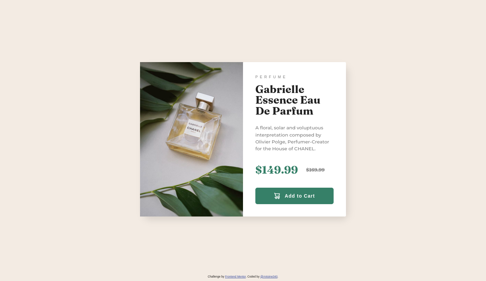

# Frontend Mentor - Results summary component solution

This is a solution to the [Product Preview Card component challenge on Frontend Mentor](https://www.frontendmentor.io/challenges/product-preview-card-component-GO7UmttRfa). Frontend Mentor challenges help you improve your coding skills by building realistic projects.

## Table of contents

- [Overview](#overview)
   - [The challenge](#the-challenge)
   - [Screenshot](#screenshot)
   - [Links](#links)
- [Built with](#built-with)

## Overview

### The challenge

### Links

- Solution URL: [https://endearing-mousse-55e69b.netlify.app/](https://effortless-gelato-738bfe.netlify.app/)

## Built with

- Vue 3
- Vite
- Vuetify 3
- TypeScript
- SASS

## Author

- Frontend Mentor - [@Antoine340](https://www.frontendmentor.io/profile/Antoine340)
- Linkedin - [@Antoine](https://www.linkedin.com/in/antoine-chauvin-994642124/)
